<a href="https://kingcaleb.com">
  
</a>

<p align="center">
  <a href="https://www.youtube.com/@CalebKing0"></a>
  <a href="https://newsletter.kingcaleb.com"></a>
  <a href="https://x.com/kingcaleb3"></a>
  <a href="https://www.linkedin.com/in/calebking3/"></a>
  <a href="https://kingcaleb.com"></a>
  <a href="mailto:info@kingcaleb.com"></a>
</p>

## Hey, I'm Caleb 👋

I went from engineer to **Engineering Director by 30**, and now I break down AI, engineering and the tech industry on YouTube, in plain language and with real examples. I build a lot of what I talk about. I'm a Tech Dad, learning and teaching in public.

```ts
const caleb = {
  role:      "Engineering Director → Educator",
  teaching:  ["AI in plain language", "engineering careers", "shipping fast"],
  building:  "AI-native products with Claude, Next.js, Swift & Kotlin",
  openTo:    ["speaking", "advisory", "brand partnerships"],
  reachMe:   "info@kingcaleb.com",
};
```

## 🚀 What I'm working on

<table>
  <tr>
    <td width="50%"><a href="https://getlaunchkit.app"></a></td>
    <td width="50%"><a href="https://www.youtube.com/@CalebKing0"></a></td>
  </tr>
  <tr>
    <td width="50%"><a href="https://newsletter.kingcaleb.com"></a></td>
    <td width="50%"><a href="https://github.com/CalebKing3/promptLibrary"></a></td>
  </tr>
</table>

## 🎥 Latest on YouTube

<!-- BEGIN YOUTUBE-CARDS -->
[](https://www.youtube.com/shorts/UuQeV1YjpWY#gh-dark-mode-only)[](https://www.youtube.com/shorts/UuQeV1YjpWY#gh-light-mode-only)
[](https://www.youtube.com/shorts/jZnyLqnsFLI#gh-dark-mode-only)[](https://www.youtube.com/shorts/jZnyLqnsFLI#gh-light-mode-only)
[](https://www.youtube.com/shorts/mh_j-N4uLRk#gh-dark-mode-only)[](https://www.youtube.com/shorts/mh_j-N4uLRk#gh-light-mode-only)
[](https://www.youtube.com/shorts/DzvKc77kE7I#gh-dark-mode-only)[](https://www.youtube.com/shorts/DzvKc77kE7I#gh-light-mode-only)
[](https://www.youtube.com/watch?v=hf28dN_ixVw#gh-dark-mode-only)[](https://www.youtube.com/watch?v=hf28dN_ixVw#gh-light-mode-only)
[](https://www.youtube.com/watch?v=p4psWwHp8qU#gh-dark-mode-only)[](https://www.youtube.com/watch?v=p4psWwHp8qU#gh-light-mode-only)
<!-- END YOUTUBE-CARDS -->

## ✉️ Latest from Build Different

<!-- NEWSLETTER:START -->
- **[Your opinion of AI is probably valid but irrelevant](https://newsletter.kingcaleb.com/p/your-opinion-of-ai-is-probably-valid)** <sub>· Sep 22, 2026</sub>
- **[Anthropic Just Dropped An AI That Scares Cybersecurity Experts](https://newsletter.kingcaleb.com/p/anthropic-just-dropped-an-ai-that)** <sub>· Apr 13, 2026</sub>
- **[I Got Invited to YouTube HQ. Here’s What I Learned.](https://newsletter.kingcaleb.com/p/i-got-invited-to-youtube-hq-heres)** <sub>· Apr 7, 2026</sub>
- **[The Weirdest Thing About Getting Laid Off in 2026](https://newsletter.kingcaleb.com/p/the-weirdest-thing-about-getting)** <sub>· Mar 27, 2026</sub>
- **[Building websites used to take weeks. Now it takes an afternoon.](https://newsletter.kingcaleb.com/p/building-websites-used-to-take-weeks)** <sub>· Mar 4, 2026</sub>
<!-- NEWSLETTER:END -->

## 🧰 Toolbox

<p>
  
</p>

<p>
  
  
  
  
  
  
</p>

## 🐍 Shipping, one square at a time

<picture>
  <source media="(prefers-color-scheme: dark)" srcset="https://raw.githubusercontent.com/CalebKing3/CalebKing3/output/snake-dark.svg" />
  
</picture>

<p align="center">
  <sub>Videos and newsletter update automatically every day. Built with ☕ and Claude.</sub>
</p>
